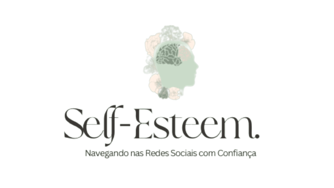

<div align="center">
	<br>
	<div>
		
	</div>
	<br>
	<br>
	<br>
	<br>
	<br>
	<br>
	<br>
	<br>
	<br>
	<br>
</div>

> Refúgio de Autoestima e Bem-Estar

Seja bem-vinda a um espaço pensado especialmente para você, um refúgio dedicado à promoção da autoestima e ao fortalecimento emocional das mulheres. Aqui, reconhecemos a importância da jornada da autoaceitação, especialmente em um mundo onde as redes sociais muitas vezes distorcem a realidade.

## Instalação

```sh
npm install
```

## Uso

```sh
npm run start
```

Abra um novo terminal e rode esses comandos, para rodar o servidor:

## Instalação Servidor

```sh
cd src/backend
```

```sh
npm i
```

```sh
npx prisma db push
```

## Uso Servidor

```sh
node app.js
```

A aplicação estará disponível na porta 3000.

## Sobre Nós

Este é um lugar criado com carinho e atenção por Nathalia Machado, com o propósito de oferecer suporte e inspiração para mulheres que buscam uma autoimagem positiva e desejam fortalecer sua saúde emocional.

## Missão

Nosso compromisso é caminhar ao seu lado enquanto exploramos a importância da autoestima, da saúde emocional e da verdadeira aceitação. Entendemos que essa jornada pode ser desafiadora, mas acreditamos que, juntas, podemos criar um ambiente onde a autenticidade e o amor-próprio florescem.

## O Que Esperar

- Conteúdo Inspirador: Publicamos regularmente conteúdo que visa inspirar e fortalecer a sua jornada de autoconhecimento.
- Comunidade Apoiadora: Este é um espaço para compartilhar experiências, aprender umas com as outras e construir uma comunidade de apoio mútuo.
- Dicas Práticas: Oferecemos dicas práticas e recursos para promover a autoestima e a saúde emocional no dia a dia.

# Agradecimento

Agradecemos por se juntar a nós nesta jornada. Sua presença enriquece nosso refúgio, e estamos ansiosos para crescer e aprender ao seu lado.

Sinta-se em casa, pois este é um local onde a autenticidade e o amor-próprio são celebrados. Estamos aqui para apoiar, inspirar e promover um ambiente onde cada mulher se sinta verdadeiramente bem consigo mesma.

Com carinho,

Nathalia Machado
